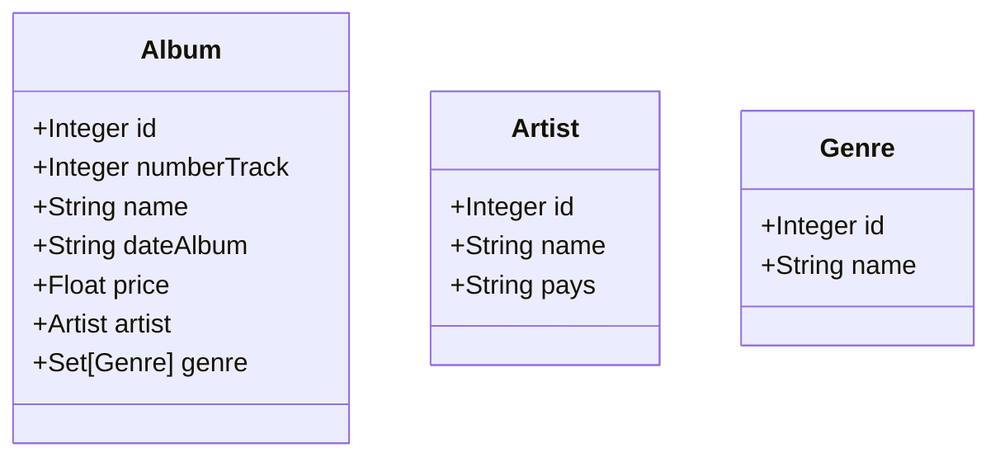

# API Rest

> Nous avons décidé de créer une API de musique. Dans laquelle on trouve des Albums, Artistes et des Genres. Pour des choix techniques nous avons décidé qu’un Album avait un Artist et qu’un Artist avait plusieurs Albums. Les Albums peuvent avoir plusieurs Genres et les Genres peuvent appartenir à plusieurs Albums.
> 

⚠️  LE PROJET NE DOIT PAS ETRE EXECUTE SUR LE RESEAU DE L’IUT




# Base de données

Pour le stockage des données nous avons choisi Microsoft Azure (2Go) ce qui permet de stocker les données dans le cloud, et nécessite aucune configuration de votre côté pour l’exécution du programme. Noté que si vous exécuter le projet sous le réseau de l’IUT il est bloqué par le par-feux.


Dans l’application vous trouverez un fichier `schema.sql` ****qui détermine la structure de nos tables. A chaque démarrage du projet l’application ajoute des données venant de `[https://theaudiodb.com](https://theaudiodb.com)`, permettant de remplir la base de données. Grâce au fichier `ApiTheAudioDb.java`

# Docs

Une fois l’application lancé vous pouvez trouver toutes les routes à l’adresse suivante : [`http://localhost:9090/swagger-ui/`](http://localhost:9090/swagger-ui/)

# Lancer l’application

Pour lancer l’application il faut la build, puis générer un jar, puis l’exécuter. Lancer les commandes à la racine du projet.

```bash
$bash : ./gradlew build #Build de l'application

$bash : ./gradlew jar #Créer un jar

$bash : java -jar build/libs/ApiMusic21-0.0.1-SNAPSHOT.jar #Lance le serveur
```

# Insomnia

[The API Design Platform and API Client](https://insomnia.rest/)

Si vous utilisez Insomnia pour tester les apis voici le fichier json des requêtes que vous pouvez importer.

[Insomnia_2022-01-19.yaml](API%20Rest%20d644dd080f4d473fb1dff2ed73f986eb/Insomnia_2022-01-19.yaml)

> Tutoriel pour importer les data
> 

[Import and Export Data](https://docs.insomnia.rest/insomnia/import-export-data)

# Exemple de requête avec curl

Sinon vous pouvez faire les commandes avec un bash et curl.

## Genres

### Récupère tous les genres

```bash
curl --request GET \
  --url http://localhost:9090/Genres/ \
  --header 'Content-Type: application/json' \
  --data '{}'
```

### Ajouter un genre

```bash
curl --request POST \
  --url http://localhost:9090/Genres/ \
  --header 'Content-Type: application/json' \
  --data '    {
        "name" : "Nouveau Genre"
    }'
```

### Trouver genre par id

```bash
curl --request GET \
  --url http://localhost:9090/Genres/1 \
  --header 'Content-Type: application/json' \
  --data '{}'
```

### Trouver genre par nom

```bash
curl --request GET \
  --url http://localhost:9090/Genres/name/rap \
  --header 'Content-Type: application/json' \
  --data '{}'
```

### Supprimer genre par id

```bash
curl --request DELETE \
  --url http://localhost:9090/Genres/1 \
  --header 'Content-Type: application/json' \
  --data '{}'
```

### Mettre à jour un genre

```bash
curl --request PUT \
  --url http://localhost:9090/Genres/2 \
  --header 'Content-Type: application/json' \
  --data '{
    "name" : "test"
}'
```

---

## Artists

### Récupère tous les artits

```bash
curl --request GET \
  --url http://localhost:9090/Artistes/ \
  --header 'Content-Type: application/json' \
  --data '{}'
```

### Récupère artist par id

```bash
curl --request GET \
  --url http://localhost:9090/Artistes/2
```

### Ajouter un artist

```bash
curl --request POST \
  --url http://localhost:9090/Artistes/ \
  --header 'Content-Type: application/json' \
  --data '{
		"id" : "50",
    "name":"lrt",
    "pays":"états-unis"
}'
```

### Récupère un artist par son nom

```bash
curl --request GET \
  --url http://localhost:9090/Artistes/name/the \
  --header 'Content-Type: application/json' \
  --data '{}'
```

### Récupère un artist par son pays

```bash
curl --request GET \
  --url http://localhost:9090/Artistes/pays/ca \
  --header 'Content-Type: application/json' \
  --data '{}'
```

### Supprimer un artist par son id

```bash
curl --request DELETE \
  --url http://localhost:9090/Artistes/2 \
  --header 'Content-Type: application/json' \
  --data '{}'
```

### Mettre à jour un artist

```bash
curl --request PUT \
  --url http://localhost:9090/Artistes/1 \
  --header 'Content-Type: application/json' \
  --data '{
    "id":"1",
    "name" : "xxxtenatcion",
    "pays" : "test"    
}'
```

---

## Albums

### Récupère tous les Albums

```bash
curl --request GET \
  --url http://localhost:9090/Album/ \
  --header 'Content-Type: application/json' \
  --data '{}'
```

### Trouve les albums par leur nom

```bash
curl --request GET \
  --url http://localhost:9090/Album/name/Hous \
  --header 'Content-Type: application/json' \
  --data '{}'
```

### Trouve les albums par rapport à leur nombre de piste

```bash
curl --request GET \
  --url http://localhost:9090/Album/tracks/5 \
  --header 'Content-Type: application/json' \
  --data '{}'
```

### Trouve les albums par rapport à leur prix

```bash
curl --request GET \
  --url http://localhost:9090/Album/price/2.5
```

### Ajoute un album

```bash
curl --request POST \
  --url http://localhost:9090/Album/add/stromae \
  --header 'Content-Type: application/json' \
  --data '{
    "id":"5",
    "date": "2021",
    "name" : "dorianAlbum",    
    "numberTrack": "10",
    "price": "21.21"
}
'
```

### Ajoute un genre à un album

```bash
curl --request PUT \
  --url http://localhost:9090/Album/addGenre/2/3/ \
  --header 'Content-Type: application/json' \
  --data '{}'
```